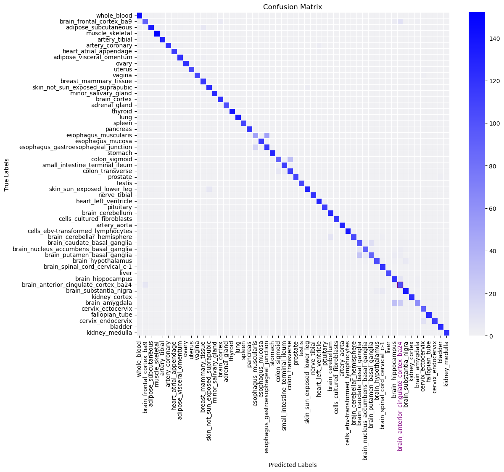

# Saliency maps for RNAseq data

## Motivation
Saliency maps are a widely used approach in computer vision for highlighting regions of interest in an image, effectively identifying the importance of each pixel in a machine learning model's inference process. 
By doing so, they help mitigate the "black-box" nature of neural networks and, in some cases, reveal novel insights into the features a model uses—some of which might be nearly imperceptible to the human eye.\
Biological systems are inherently complex, and despite advancements in machine learning and deep learning, understanding their underlying mechanisms remains a significant challenge. 
The growing availability of open-source biological data has made computational approaches increasingly viable for tasks such as correlation analysis and classification. Among these, transcriptomics plays a crucial role in deciphering biological pathways by capturing gene expression patterns across different conditions, tissues, and time points. Analyzing these expression profiles enables researchers to identify key regulatory networks, uncover disease mechanisms, and gain deeper insights into the molecular processes that drive cellular functions.

The goal of this project was twofold: first, to develop a classification model trained on RNA-seq samples from various human tissues, enabling it to categorize a given sample into one of the many tissue types available in the dataset. 
Once the model was trained and validated, saliency mapping is applied to correctly classified samples to analyze the importance of each primary input unit—specifically, each gene expression—in predicting the sample's label (tissue type).

By leveraging this approach, new insights can be gained into the inherent biological factors that distinguish one tissue from another. Such insights would typically require extensive pairwise differential gene expression analyses, followed by complex statistical processing to account for the variability in biological data.

## The Data
The [Genotype-Tissue Expression (GTEx) Project](https://www.gtexportal.org/home/) is an open-source database that provides RNA-seq and genetic variation data across diverse human tissues. It enables researchers to explore tissue-specific gene expression and regulatory mechanisms. With its publicly available data, GTEx serves as a key resource for studying the genetic basis of human traits and diseases.

The dataset used in this project consists of RNA-seq samples from 54 different human tissues, each serving as a distinct classification label. However, the sample sizes for each tissue type are unevenly distributed, creating an imbalance that could affect model performance. To address this, data augmentation techniques were applied to improve representation across underrepresented labels. The minimal number of samples for each label can be set using the ```min_smaples``` parameter. when set, the program will genrerate the additional needed number of samples up to the size desired. 
Additionally, the program is designed to flexibly retrieve the dataset—it can either download the data directly from the server or load it from a local directory using a designated flag. 

<!--  -->


*PCA for samples from 3 different tissues without data augmentation (upper) and with augmented sample size (lower)*

## The Model
The classification model was constructed as a four-layer dense neural network using PyTorch. To ensure the model could be deployed on a reasonably equipped laptop, its size had to be optimized, which required constraining the input dimensions. Instead of using the full gene expression profile for each sample, only genes with a known protein product were selected as input features for training and prediction (In future projects, larger input sets may be explored.) 
To use a subset of the gene expression matrix provided by GTEx, you must pass a path of a .txt file with a list of ENSEMBL gene ids as the argument for the ```--input-filter``` parameter.  

Each sample was assigned one of 54 labels, making Cross-Entropy loss the appropriate choice for measuring the model's error. The entire process of constructing, training, and validating the model was performed on a laptop equipped with an NVIDIA GeForce RTX 4060 GPU and approximately 8 GB of RAM. After training, the model contained 157,063,310 parameters and occupied approximately 1.8 GB of memory.

A key objective of this project was to develop an iterative workflow that allows for optimizing the classification model by modifying various parameters and configurations. During each training run, progress is monitored and visualized using TensorBoard, providing insights into model performance and aiding in the refinement process.


*monitoring loss and accuracy for validation set for several model developing iterations using Tensorboard.*

For the demonstration in this document, the model was obtained using the following arguments:
```
dev=gpu
min_samples=600
test_opt=1
epochs=20
batch_size=16
lr=1e-05
delta=0.0
patience=5
decay=0.0001
```

The model's performance can be evaluated using label-level metrics and a confusion matrix, both generated as part of the program's workflow via the ```test_opt``` parameter.

Notably, the model performed less effectively on brain tissues compared to other tissue types, as shown in the performance table. This may be due to the similarity among brain tissues and their low variance relative to non-brain tissues, as reflected in the confusion matrix below.


| Label                                 |   precision |   recall |   f1-score |   support |
|:--------------------------------------|------------:|---------:|-----------:|----------:|
| whole_blood                           |    1        | 1        |   1        |       142 |
| brain_frontal_cortex_ba9              |    0.91     | 0.8125   |   0.858491 |       112 |
| adipose_subcutaneous                  |    0.978102 | 0.943662 |   0.960573 |       142 |
| muscle_skeletal                       |    1        | 1        |   1        |       152 |
| artery_tibial                         |    0.992424 | 0.992424 |   0.992424 |       132 |
| artery_coronary                       |    0.991736 | 0.952381 |   0.97166  |       126 |
| heart_atrial_appendage                |    0.974359 | 0.982759 |   0.978541 |       116 |
| adipose_visceral_omentum              |    0.960317 | 0.975806 |   0.968    |       124 |
| ovary                                 |    0.983871 | 0.99187  |   0.987854 |       123 |
| uterus                                |    0.990654 | 0.972477 |   0.981481 |       109 |
| vagina                                |    0.972973 | 0.964286 |   0.96861  |       112 |
| breast_mammary_tissue                 |    0.920635 | 1        |   0.958678 |       116 |
| skin_not_sun_exposed_suprapubic       |    0.953846 | 0.976378 |   0.964981 |       127 |
| minor_salivary_gland                  |    1        | 0.976923 |   0.988327 |       130 |
| brain_cortex                          |    0.945736 | 0.99187  |   0.968254 |       123 |
| adrenal_gland                         |    1        | 1        |   1        |       102 |
| thyroid                               |    1        | 1        |   1        |       140 |
| lung                                  |    1        | 0.985294 |   0.992593 |       136 |
| spleen                                |    1        | 1        |   1        |       109 |
| pancreas                              |    1        | 1        |   1        |       119 |
| esophagus_muscularis                  |    0.735294 | 0.49505  |   0.591716 |       101 |
| esophagus_mucosa                      |    0.991379 | 1        |   0.995671 |       115 |
| esophagus_gastroesophageal_junction   |    0.684524 | 0.845588 |   0.756579 |       136 |
| stomach                               |    0.984733 | 0.984733 |   0.984733 |       131 |
| colon_sigmoid                         |    0.910891 | 0.736    |   0.814159 |       125 |
| small_intestine_terminal_ileum        |    0.957265 | 0.957265 |   0.957265 |       117 |
| colon_transverse                      |    0.768707 | 0.91129  |   0.833948 |       124 |
| prostate                              |    1        | 0.973214 |   0.986425 |       112 |
| testis                                |    1        | 1        |   1        |       107 |
| skin_sun_exposed_lower_leg            |    0.977612 | 0.949275 |   0.963235 |       138 |
| nerve_tibial                          |    1        | 1        |   1        |       120 |
| heart_left_ventricle                  |    0.948529 | 1        |   0.973585 |       129 |
| pituitary                             |    1        | 1        |   1        |       112 |
| brain_cerebellum                      |    0.940741 | 1        |   0.969466 |       127 |
| cells_cultured_fibroblasts            |    1        | 1        |   1        |       118 |
| artery_aorta                          |    1        | 0.992308 |   0.996139 |       130 |
| cells_ebv-transformed_lymphocytes     |    1        | 1        |   1        |       135 |
| brain_cerebellar_hemisphere           |    1        | 0.905983 |   0.950673 |       117 |
| brain_caudate_basal_ganglia           |    0.720588 | 0.823529 |   0.768627 |       119 |
| brain_nucleus_accumbens_basal_ganglia |    0.90099  | 0.784483 |   0.83871  |       116 |
| brain_putamen_basal_ganglia           |    0.854369 | 0.682171 |   0.758621 |       129 |
| brain_hypothalamus                    |    0.928571 | 0.881356 |   0.904348 |       118 |
| brain_spinal_cord_cervical_c-1        |    0.930769 | 0.991803 |   0.960317 |       122 |
| liver                                 |    1        | 1        |   1        |       103 |
| brain_hippocampus                     |    0.707602 | 0.923664 |   0.801325 |       131 |
| brain_anterior_cingulate_cortex_ba24  |    0.658065 | 0.857143 |   0.744526 |       119 |
| brain_substantia_nigra                |    0.9375   | 0.944056 |   0.940767 |       143 |
| kidney_cortex                         |    1        | 0.99187  |   0.995918 |       123 |
| brain_amygdala                        |    0.911765 | 0.525424 |   0.666667 |       118 |
| cervix_ectocervix                     |    0.875    | 1        |   0.933333 |        91 |
| fallopian_tube                        |    0.992126 | 0.992126 |   0.992126 |       127 |
| cervix_endocervix                     |    1        | 0.918699 |   0.957627 |       123 |
| bladder                               |    0.976562 | 1        |   0.988142 |       125 |
| kidney_medulla                        |    0.983607 | 1        |   0.991736 |       120 |
||||||------------:|---------:|-----------:|----------:|
| **accuracy**                              |    0.938303 | 0.938303 |   0.938303 |         0 |
| **macro avg**                             |    0.941701 | 0.936771 |   0.936238 |      6613 |
| **weighted avg**                          |    0.942293 | 0.938303 |   0.937399 |      6613 |

*overall and label-level precision/recall and f1 scores for the model used for this demo*


\
\



*confusion matrix for the model used for this demo - notice mismatches mostly occur between closely realted tissues, namely between brain and esophgus tissues*


## Saliency
The function saliency(x, abs=False) generates a saliency map by computing the gradient of the predicted class score with respect to the input. This technique identifies which input features most influence the model’s decision, making it a useful tool for interpretability.

To achieve this, the function first disables gradient updates for the model parameters and sets the model to evaluation mode. The input x is then marked for gradient tracking, and a forward pass is performed to obtain predictions. The function selects the class with the highest score and computes its gradient with respect to x using backpropagation. The resulting gradient represents how changes in each input feature impact the model’s output. If abs=True, the absolute values of the gradients are taken to emphasize importance regardless of direction. Finally, the saliency map is normalized to a [0,1] range for better interpretability.

This method is particularly useful in explaining model predictions by highlighting the most influential input features. In image processing, it reveals key pixels that contribute to classification, while in biological applications, such as gene expression analysis, it can uncover critical genes that differentiate between tissue types or conditions.

In the ```Saliency.ipynb``` notebook, the "saliency" function is applied to correctly predicted samples from each label to generate tissue-specific saliency maps. The figure below illustrates the top 20 genes with the highest impact on the model when predicting Pancreas tissue (outlined in blue), alongside their impact on other tissue predictions. Notably, these genes show a distinctly higher influence in Pancreas compared to other tissues.


*Saliency values of the top 20 genes in Pancreas, shown across all tissues. Values for Pancreas are outlined in blue.*

This highlights the uniqueness of gene sets in each tissue, which is not necessarily driven by increased expression but rather by consistent expression patterns. Such patterns may provide insights into the underlying biological relationships and regulatory networks that govern tissue-specific functions.
    

